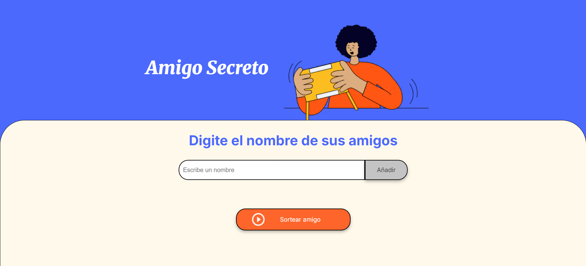

# 🎁 Sorteo de Amigo Secreto

Este proyecto permite ingresar nombres de amigos y luego seleccionar uno al azar como "amigo secreto". Está desarrollado con HTML, CSS y JavaScript, ideal para practicar lógica de programación y manejo del DOM.

## 🚀 Funcionalidades

- Agrega hasta 5 nombres válidos.
- Muestra los nombres ingresados en pantalla.
- Sortea un nombre al azar como "amigo secreto".
- Muestra el resultado en pantalla.
- Valida que no se ingresen campos vacíos.
- Limpia automáticamente la lista al finalizar el sorteo.

## 🛠️ Tecnologías utilizadas

- HTML5
- JavaScript
- CSS

## 📄 Estructura del proyecto

/challenge-amigo
│
├── index.html         # Interfaz principal
├── app.js             # Lógica del sorteo y validaciones
├── style.css          # Estilos
└──/assets/            # Imágenes
    ├── amigo-secreto.png
    ├── play_circle_outline.png
    └── vista-previa.png

## ▶️ Cómo usar

1. Abre `index.html` en tu navegador.
2. Escribe un nombre y haz clic en "Agregar amigo".
3. Repite hasta 5 veces.
4. Haz clic en "Sortear amigo secreto" para ver el resultado.

## ✏️ Notas

- Si se intenta sortear más de 5 amigos, se muestra una alerta.
- Se reinicia la lista automáticamente después del sorteo.
- Si se intenta sortear sin nombres, se muestra una alerta.

## 📷 Vista previa 

---

¡Diviértete programando y mejorando este mini proyecto!
